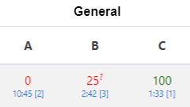
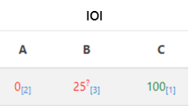
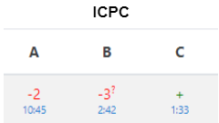

# BACS evaluation system

This file contains information about contest evaluation systems. There are two popular decision evaluation systems in programming competitions:

### ICPC:

Only complete solutions are counted in this system. At the same time, for each completed task, the participant is awarded a penalty time equivalent to the time from the start of the competition to receiving a successful solution, plus 20 minutes for each unsuccessful previous solution to complete this task.

Participants are sorted by:
1. decreasing the number of solved tasks;
2. increasing the penalty time;
3. increasing the time of the last successful attempt.

### IOI:

Partial solutions are counted in this system and up to one hundred points can be scored for each task. Participants are sorted only by the number of points scored and may have the same places in the table. Provided that the solution has passed the pretests, all other tests are evaluated separately. That is, if for ICPC a solution that failed one test is completely rejected, then for IOI it will receive 95+ points.

### General:

The General system combines ICPC and IOI. As in IOI, the solution may be partial. And as in ICPC, the penalty time is taken into account, but until the last decision that improved the result of the task.

Participants are sorted by:
1. decreasing the number of points;
2. decreasing the number of solved tasks;
3. increasing the penalty time;
4. increasing the time of the last successful attempt.

### Displaying the results:

In the General system the display of results in a table cell consists of four elements:
1. The number of points scored. The large font in the center of the cell is displayed in green for a problem with a complete solution and in red otherwise.
2. A token for verifying the solution. If one of the participant's parcels is currently being checked, then a question mark with a smaller font size and the same color is displayed to the top right of the number of points.
3. The number of solutions. It is displayed to the bottom right of the number of points in square brackets.
4. Penalty time. It is displayed under the number of points in the hours:minutes format. If the penalty time is too long, then calculating it for each task loses its meaning and an infinity sign will be displayed in the monitor instead of large numbers.

Since the penalty time is not required to be displayed in the IOI system, attempts are displayed not on the second line, but in the lower index to the right of the number of points in the same line.

There are no points in the ICPC system, instead a plus or minus is displayed, depending on the availability of a complete solution to the problem. The number of failed attempts by the user is displayed next to the sign, so you do not need to display the number of attempts separately.

